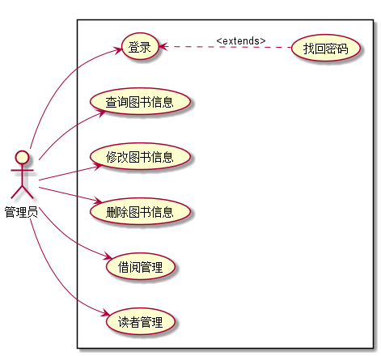
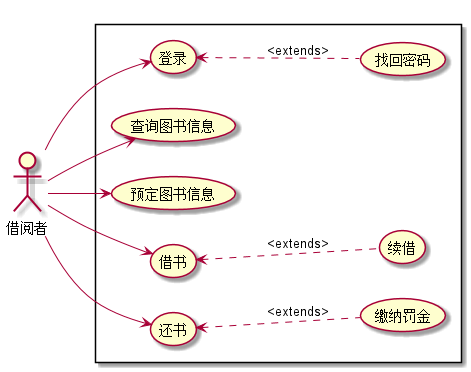
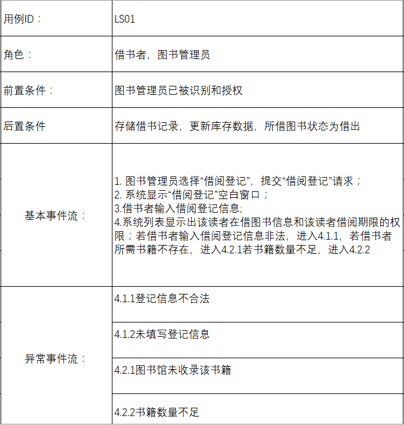
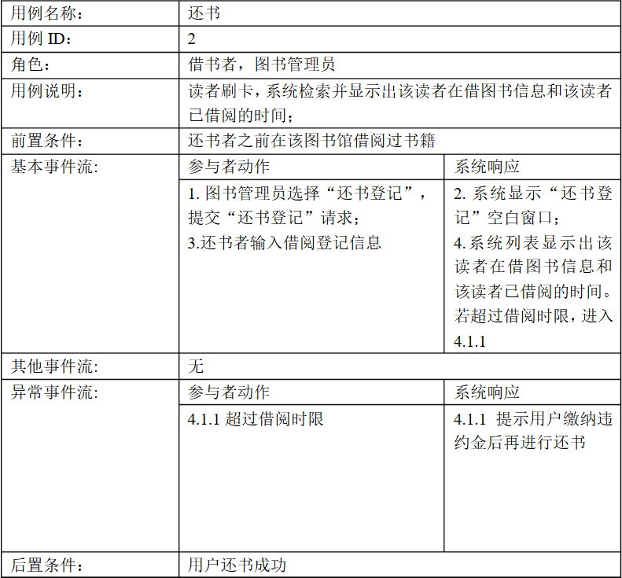
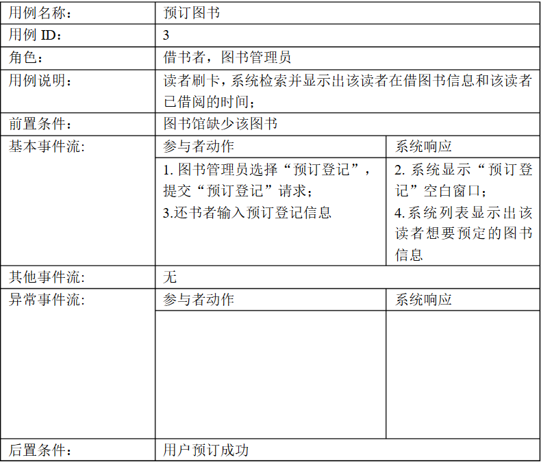

# 实验二：图书管理系统用例建模
|        学号      |     班级    |    姓名    |
|:----------------:|:-----------:|:----------:|
|   201510414401   |    软工15-4 |    陈惠翔  | 
## 1.图书管理系统的用例关系图
### 1.1管理员用例图PlantUML源码如下：
@startuml
Left to right direction
:管理员:
rectangle {
管理员-->(登录)
管理员-->(查询图书信息)
管理员-->(修改图书信息)
管理员-->(删除图书信息)
管理员-->(借阅管理)
管理员-->(读者管理)
(登录)<..(找回密码):extends
}
@enduml
### 1.2 阅者用例图如下：

### 1.3借阅者用例图PlantUML源码如下：

@startuml
Left to right direction

:读者:
rectangle {
读者-->(登录)
读者-->(查询图书信息)
读者-->(预定图书)
读者-->(借书)
读者-->(还书)
(登录)<..(找回密码):<extends>
(借书)<..(续借):<extends>
(还书)<..(缴纳罚金):<extends>
}
@enduml
@enduml
### 1.4 借阅者用例图如下：

## 2. 参与者说明：

###     2.1 借阅者
 
主要职责是：
* 登陆系统，若遗忘可找回密码；
* 查询图书信息；
* 借阅图书并可续借；
* 将图书归还给图书管理员，若逾期须缴纳罚金。
 
###     2.2 图书管理员
 
主要职责是：
* 登陆系统，若遗忘可找回密码；
* 对借阅者进行管理
* 查询图书信息
* 对图书管理系统里的图书数目进行添加，查询，修改和删除操作；
* 收取图书损坏或遗失的罚金。

##     3. 用例规约表

###     3.1 “借出图书”用例

###     3.2 “还书”用例

###     3.1 “预定图书”用例

